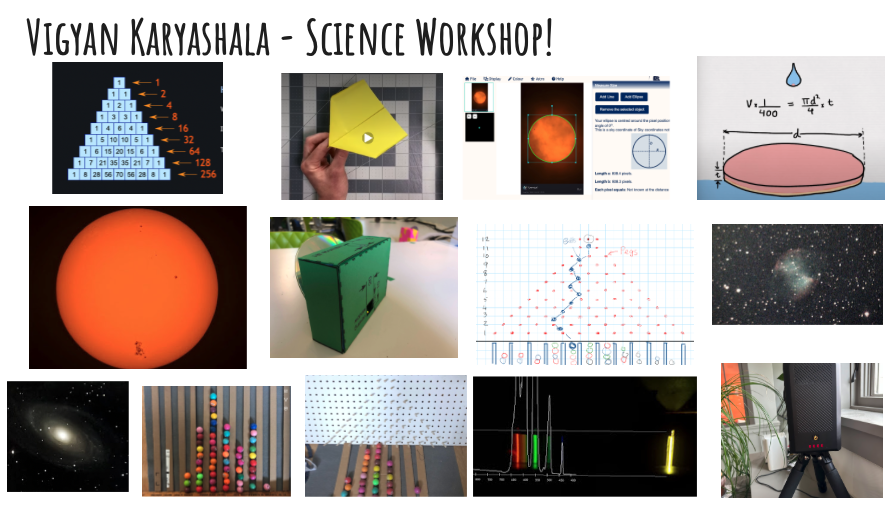

<!--
# Fibonacci Sequence, Golden Ratio, Galton Board & Pascal's triangles
An introduction to Fibonacci Sequence, Golden Ratio Pascal's triangle and many other Science & Art projects
- [A Citizen Science projects class taught by me in the summer of 2022](SCS/SCS.pdf)

-->

# Vigyan Karyashala - Science Workshop - Design - Build - Explore
### May 29 - May 31, 2026
*site updated: 30/05/26*. contact chandru drunarayan@gmail.com with any questions

### [Participants Welcome Letter](welcome_letter.md){:target="_blank"}

Parents - Join with your children for this unique science camp for the Ramanarayanan family and friends. These are topics your children will explore. At the end of the camp, students will stump the assembled parents in a quiz program.

Calculate the value of PI. Learn Powers of 10. Image the Sun via the Seestar Telescope. Calculate the Diameter of the Earth, and Sun. How big is the Sun? Schedule Remote Telescopic Observations and image Galaxies, Nebulae, Globular clusters and Stars.

Build and experiment with the Galton Board, Pascal’s Triangle, Fibonacci Numbers, Golden Ratio. Analyze results. Google Colab, Experiments & Charting Probabilities & Normal Distributions - Scientific Method.  Measure Diameter of the Atom - How small is it?. Build Paper Spectroscope. Image Spectra of Sun and other types of Light. Star Gazing Night!

On the last day, learn Group Song about Nature. Prepare a demo for parents and quiz questions. Stump the Parents Quiz later that evening!

### [Materials List for Procurement and Tasks for VK](https://docs.google.com/spreadsheets/d/1PN_e4nNGfixofIVVZubWGYc2y2JYExBu2yFek9_L5VE/edit?gid=0#gid=0){:target="_blank"}
- Items needed for workshop. Volunteer any help you can offer.

### [Vigyan Karyashala (VK) Activities](https://docs.google.com/presentation/d/1L8q5FArEkUWsPNfDLy3HekTYAK-xyk0GFg3iHbKeEBk/edit?slide=id.p#slide=id.p){:target="_blank"}
- Activities, Content Slide Deck

### [Student & Parent Participants with Username for Login](https://docs.google.com/spreadsheets/d/1BOI-sNqJvsq9w2gmftGgKQnU3YKGqPfE_oHhZqn_418/edit?gid=0#gid=0){:target="_blank"}
- Please note that you can type in your own password that you like. However, please remember for future logins. So, write it down! If you forget, I can reset it for you
- If your name is not on the list of if you have any questions write chandru: drunarayan@gmail.com

### Program Schedule, Worksheets & Jupyter Notebooks
- Order & dates are subject to last minute changes
- Details link will lead you to a website or virtual machine where a login might be required.
- For login details, please see above

Lab|Date|Topic|Worksheet or Notebook|
---|---|---|---|
1.|Fri May 29|Fibonacci Numbers in Nature|White Board & Pine Cones Lab
2.|Fri May 29|Astro Imaging|[Click for Details](notebooks/astro_imaging/){:target="_blank"}
3.|Fri May 29|Calculate Value of PI|[Click for Details](notebooks/calculate_pi/){:target="_blank"}
4.|Fri May 29|Measure Diameter of the Earth|[Click for Details](notebooks/dia_of_earth/){:target="_blank"}
5.|Sat May 30|Mobius Strip & Topology|[Click for Details](https://www.youtube.com/watch?v=2CDGxGYk4Sc){:target="_blank"}
6.|Sat May 30 8:00 AM|Krishna & Aashna Talk to Students about Best Habits for Success in Careers in Eng & Tech & Finance. Kripita Srivatsava (9th grader from New Delhi) will talk about her educational journey in astro-physics|[Google Meet](https://meet.google.com/hwo-ttfv-smv){:target="_blank"}
7.|Sat May 30|Build Paper Airplanes|[Click for Details](notebooks/paper_airplanes/){:target="_blank"}
8.|Sat May 30|Measure Diameter of the Sun|[Click for Details](notebooks/dia_of_sun/){:target="_blank"}
9.|Sat May 30|Pascal's Triangle - Galton Board|[Click for Details](notebooks/galton_board/){:target="_blank"}
10.|Sat May 30|Operate the SeeStar Telescope|[Click for Details](notebooks/seestar_telescope/){:target="_blank"}
11.|Sat May 30|Build Spectroscope|[Click for Details](notebooks/build_spectroscope/){:target="_blank"}
12.|Sat May 30|Measure Diameters of Imaged Astro Objects|[Click for Details](notebooks/measure_astro_targets/){:target="_blank"}
13.|Sun May 31|What a Wonderful World - Team Song|[Click for Details](notebooks/team_song/){:target="_blank"}
14.|Sun May 31|Prepare Quiz Questions for Stump the Parents - Decide on Rules|[Click for Details](notebooks/team_song/){:target="_blank"}
15.|Sun May 31|Final EXPO - Stump the Parents Quiz|[Click for Details](notebooks/stump_the_parents/){:target="_blank"}

