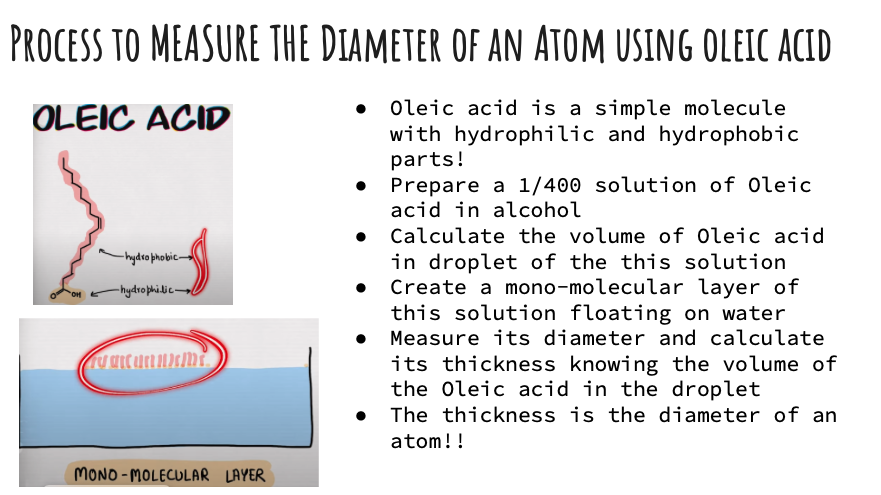

## Calculate Diameter of an Atom

Students will learn about sizes very small things like atoms. They will measure it in a lab using the Oleic acid molecule. They will learn about powers of 10.

### [Measure the size of a single Atom](https://docs.google.com/presentation/d/1L8q5FArEkUWsPNfDLy3HekTYAK-xyk0GFg3iHbKeEBk/edit?slide=id.g137189d43eb_0_71#slide=id.g137189d43eb_0_71)

