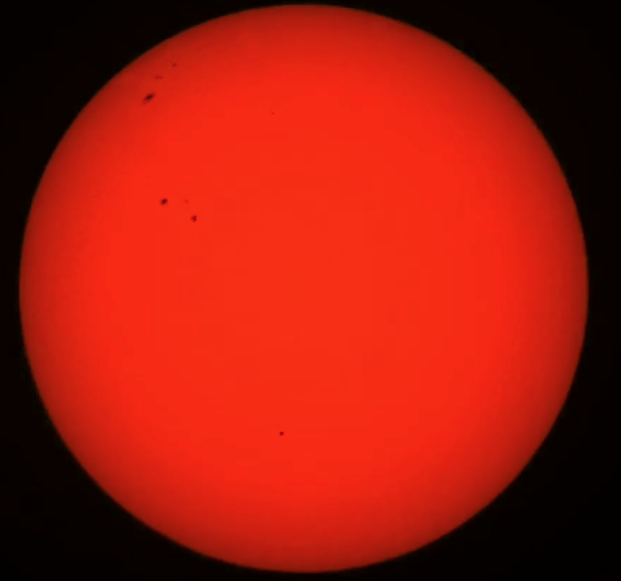

## Calculate the Diameter of the Sun

Students will learn about sizes stupendously big things like the Sun. They will measure the Sun by imaging it via the Seestar Telescope. 

### [Measure the diameter of the Sun in a Jupyter Notebook](https://boyceastrows.gleeze.com/hub/user-redirect/git-pull?repo=https://github.com/drunarayan/fibonacci&branch=gh-pages&urlpath=lab/tree/fibonacci/notebooks/dia_of_sun/sun_dia_and_dist.ipynb?reset)

